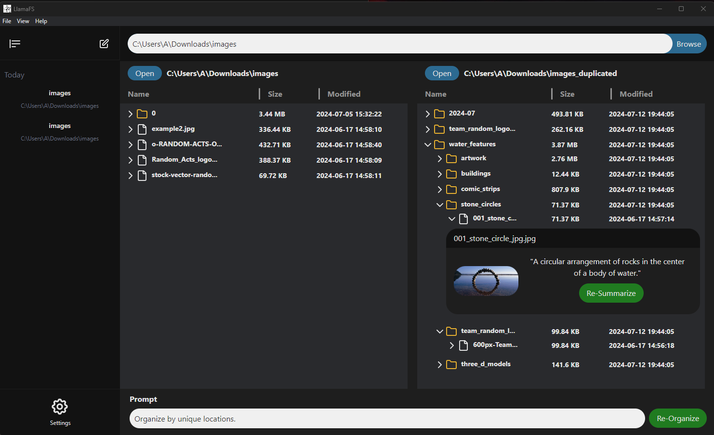

# LlamaFS v1.2.0

<div style="display: flex; justify-content: space-between; padding-bottom:20px">
  
  
  
</div>


# General Installer for Windows now available!

An installer is available in Releases.

[Or, click here to get the latest installer!
](https://github.com/adamwbull/llama-fs/releases)

If you have issues or ideas for features, please visit the [Issues](https://github.com/adamwbull/llama-fs/discussions) or [Discussions](https://github.com/adamwbull/llama-fs/issues) pages!




## The "Why"

Open your `~/Downloads` directory. Or your Desktop. It's probably a mess...

> There are only two hard things in Computer Science: cache invalidation and **naming things**.

## What it does

LlamaFS is a self-organizing file manager. It automatically renames and organizes your files based on their content and well-known conventions (e.g., time). It supports many kinds of files, including images (through Moondream).

This version of llama-fs is forked from the original over at [iyaja/llama-fs](https://github.com/iyaja/llama-fs).

While they did an excellent job of a proof-of-concept for their hackathon, their application was mostly a bare demo. So I took what they started and will continue development up to a full-featured application packaged in a general-purpose installer for anyone to use!

You can provide a directory to LlamaFS, and it will organize your files based on your instructions and settings such as move vs. copy or max folder depth. 

Uh... Sending all my personal files to an API provider?! No thank you!

You can route through ollama locally instead of groq if your computer is strong enough to run ollama. Since they both use llama3, they perform identically.

## Planned Features (v1.3.0, est. August 2024)
| Feature               | Status      | Notes               |
|-----------------------|-------------|---------------------|
| Improved AI performance | ☐ Todo | LLM can be dumb and not listen to user instructions. Improvements to our RAG will help. |
| .docx and advanced textfile support | ☐ Todo | Allow for reading simplified text file contents from more advanced types |
| Whisper support | ☐ Todo | Promised but missing from original repo. Allows the system to contextualize and organize audio files. |
| Mac context menu (double click) integration | ☐ Todo | Quickly begin organization by clicking folder in Finder |
| Compiled Mac installer for public use | ☐ Todo | Allows LlamaFS to be installed for general use |


## How we built it

I, adamwbull, am a sole developer that picked up this project because I found it fascinating and thought it deserved more love beyond the quick hackathon proof-of-concept level it was at. I am mostly extending what the previous devs already had, adding new features (or even features that were promised but not implemented, such as Whisper support) and cleaning up code in the existing architecture. And, most importantly, providing easy installers for public use.

The original team built LlamaFS on a Python backend, leveraging the Llama3 model through Groq for file content summarization and tree structuring. For local processing, we integrated Ollama running the same model to ensure privacy in incognito mode. The frontend is crafted with Electron, providing a sleek, user-friendly interface that allows users to interact with the suggested file structures before finalizing changes.

- **It's extremely fast!** (by LLM standards)! Most file operations are processed in <500ms in watch mode (benchmarked by [AgentOps](https://agentops.ai/?utm_source=llama-fs)). This is because of our smart caching that selectively rewrites sections of the index based on the minimum necessary filesystem diff. And of course, Groq's super fast inference API. 😉

- **It's immediately useful** - It's very low friction to use and addresses a problem almost everyone has. We started using it ourselves on this project (very Meta).

## Installing Manually

Before installing, ensure you have the following requirements:
- Python 3.10 or higher
- pip (Python package installer)

To install the project, follow these steps:
1. Clone the repository:
   ```bash
   git clone https://github.com/adamwbull/llama-fs.git
   ```

2. Navigate to the app directory:
    ```bash
    cd llama-fs
    ```

3. Install python requirements. Consider using a virtual environment with `python -m venv <env_name>`, then activating your virtual environment with `<env_name>/Scripts/activate` or `<env_name>/bin/activate` before running this pip install.
   ```bash
   pip install -r requirements.txt
   ```

4. Set the full path to your python installation in `app/globals.ts`. Make sure this is the python.exe in your virtual environment folder if you used one.

5. Install ollama by [visiting their GitHub repo](https://github.com/ollama/ollama).

6. Install llama3 and moondream
    ```bash
    ollama pull llama3
    ollama pull moondream
    ```

7. Install electron dependencies:
   ```bash
   cd app
   yarn install
   ```

8. Start the app.
   ```bash
   yarn start
   ```