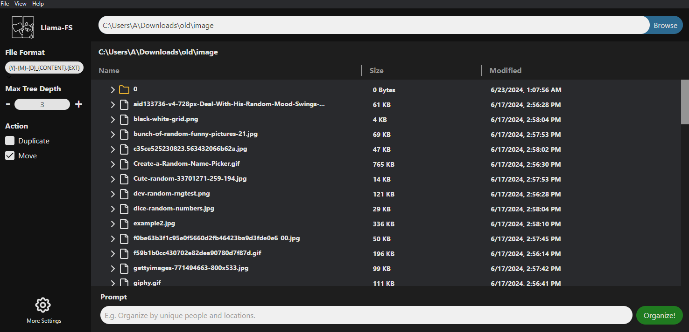

# LlamaFS v1.1

<div style="display: flex; justify-content: space-between;">
  
  
  
</div>


## Frontend v1.1 Screenshot



## Note from adamwbull

The v1.2 release with Windows installer will be here on July 1st!

This version of llama-fs is forked from the original over at [iyaja/llama-fs](https://github.com/iyaja/llama-fs).

While they did an excellent job of a proof-of-concept for their hackathon, their application was mostly a bare demo that was challenging to run. So I took what they started and will continue development up to a general-purpose installer for anyone to use!

## The "Why"

Open your `~/Downloads` directory. Or your Desktop. It's probably a mess...

> There are only two hard things in Computer Science: cache invalidation and **naming things**.

## What it does

LlamaFS is a self-organizing file manager. It automatically renames and organizes your files based on their content and well-known conventions (e.g., time). It supports many kinds of files, including images (through Moondream) and audio (through Whisper).

You can provide a directory to LlamaFS, and it will organize your files based on your instructions and settings such as move vs. copy or max folder depth. 

Uh... Sending all my personal files to an API provider?! No thank you!

You can route through ollama locally instead of groq if your computer is strong enough to run ollama. Since they both use llama3, they perform identically.


## Planned Features (v1.2)
| Feature               | Status      | Notes               |
|-----------------------|-------------|---------------------|
| Implement user prompting | ☒ Done | Promised but missing from original repo. Allow users to provide an organization strategy via prompt, and a maximum tree depth value |
| non-moondream llama3 support | ☒ Done | Promised but missing from original repo. Switch between llama3 or groq for text work depending on your privacy concerns and compute power. |
| Whisper support | ☐ In Progress | Promised but missing from original repo. Allows the system to contextualize and organize audio files. |
| Frontend model controls | ☐ In Progress | Allow users to customize settings such as model, file output format, tree depth, groq API key, etc. |
| Frontend move, duplicate options | ☐ In Progress | Toggle how the system handles quick file organization |
| Frontend preview changes mode | ☐ In Progress | Instead of quick organization, preview changes and individually move, duplicate, or remove files intelligently |
| Windows context menu (right click) integration | ☐ Todo | Quickly begin organization by right clicking files in File Explorer |
| Compiled Windows installer for public use | ☐ Todo | Allows LlamaFS to be installed for general use |
| Mac context menu (double click) integration | ☐ Todo | Quickly begin organization by clicking folder in Finder |
| Compiled Mac installer for public use | ☐ Todo | Allows LlamaFS to be installed for general use |

One feature I removed from the original was the watcher daemon. This daemon could be enabled and used to "watch" a folder for new files being added, and organize them automatically. 

I found this feature to be unintuitive from an end-user perspective. My design principles are instead focusing on integrating LlamaFS through clicking on a folder you want organized in File Explorer or Finder, optionally providing explicit instructions in a small popup, and executing the task without hanging background processes or an AI moving files on you unexpectedly.

## How we built it

I, adamwbull, am a sole developer that picked up this project because I found it fascinating and thought it deserved more love beyond the quick hackathon proof-of-concept level it was at. I am mostly extending what the previous devs already had, adding new features (or even features that were promised but not implemented, such as Whisper support) and cleaning up code in the existing architecture. And, most importantly, providing easy installers for public use.

The original team built LlamaFS on a Python backend, leveraging the Llama3 model through Groq for file content summarization and tree structuring. For local processing, we integrated Ollama running the same model to ensure privacy in incognito mode. The frontend is crafted with Electron, providing a sleek, user-friendly interface that allows users to interact with the suggested file structures before finalizing changes.

- **It's extremely fast!** (by LLM standards)! Most file operations are processed in <500ms in watch mode (benchmarked by [AgentOps](https://agentops.ai/?utm_source=llama-fs)). This is because of our smart caching that selectively rewrites sections of the index based on the minimum necessary filesystem diff. And of course, Groq's super fast inference API. 😉

- **It's immediately useful** - It's very low friction to use and addresses a problem almost everyone has. We started using it ourselves on this project (very Meta).

## Installation

### Compiled Installer

Soon, I will have installers for Windows and Mac for anyone to quickly start using this with no other work necessary. Stay tuned! 

### Installing Manually

Before installing, ensure you have the following requirements:
- Python 3.10 or higher
- pip (Python package installer)

To install the project, follow these steps:
1. Clone the repository:
   ```bash
   git clone https://github.com/adamwbull/llama-fs.git
   ```

2. Navigate to the app directory:
    ```bash
    cd llama-fs
    ```

3. Install python requirements. Consider using a virtual environment with `python -m venv <env_name>`, then activating your virtual environment with `<env_name>/Scripts/activate` or `<env_name>/bin/activate` before running this pip install.
   ```bash
   pip install -r requirements.txt
   ```

4. Set the full path to your python installation in `app/globals.ts`. Make sure this is the python.exe in your virtual environment folder if you used one.

5. Install ollama by [visiting their GitHub repo](https://github.com/ollama/ollama).

6. Install llama3 and moondream
    ```bash
    ollama pull llama3
    ollama pull moondream
    ```

7. Install electron dependencies:
   ```bash
   cd app
   yarn install
   ```

8. Start the app.
   ```bash
   yarn start
   ```